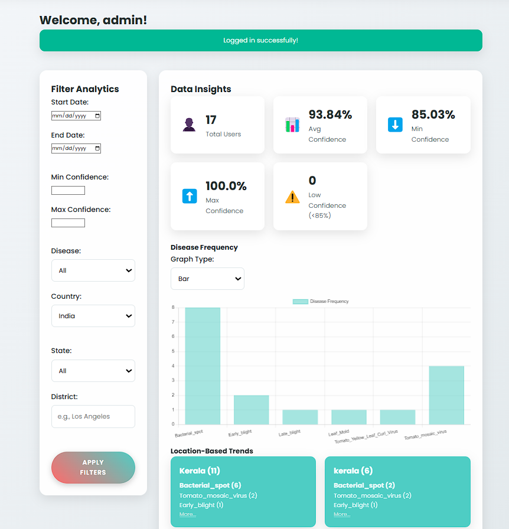
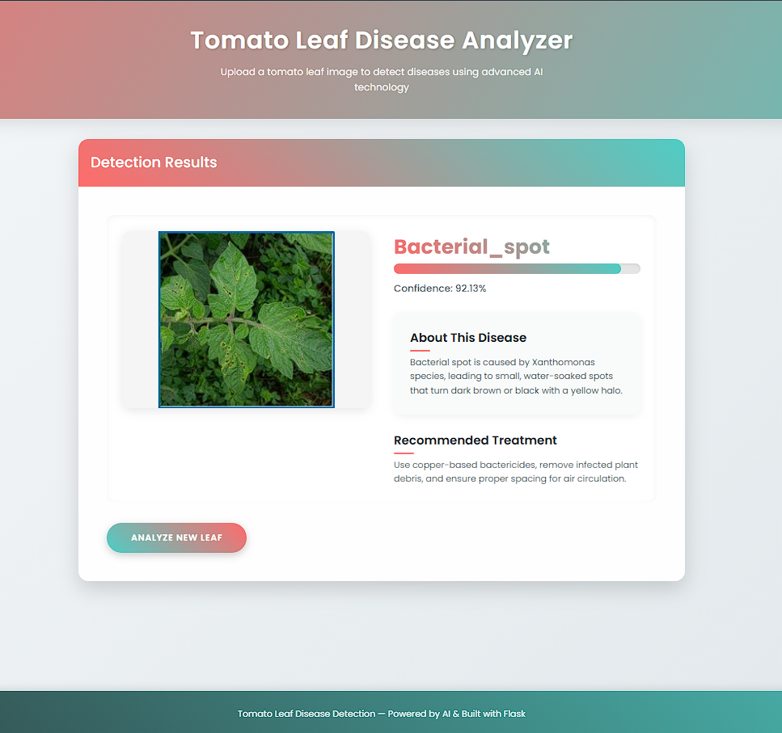

# Tomato Leaf Disease Detection Using MobileNetV2

This project is an AI-powered web application that detects and classifies tomato leaf diseases using deep learning techniques. The system is built using a fine-tuned **MobileNetV2** model with over **95% accuracy**. The application includes an admin dashboard to visualize disease trends by region and utilizes **OpenCV** for image preprocessing.

## Features

- **AI-powered Disease Detection**: Classifies tomato leaf diseases into 11 categories (including healthy).
- **MobileNetV2 Architecture**: Pre-trained MobileNetV2 fine-tuned for tomato leaf disease classification.
- **OpenCV Preprocessing**: Enhances image quality before classification.
- **Admin Dashboard**: Visualizes regional disease trends, classification performance, and allows easy model management.

## Model Training Overview

### Core Task:
Tomato leaf disease classification into 11 categories (including healthy).

### Model Architecture:
- **Base Model**: Uses **MobileNetV2**, a lightweight convolutional neural network pre-trained on ImageNet. The top classification layer is removed, and custom layers are added.
- **Custom Layers**: 
  - BatchNormalization
  - Dense layer with ReLU activation and L2 regularization
  - Dropout for regularization
  - Final Dense layer with softmax activation for 11-class classification

### Data Handling:
- **Dataset Location**: Training and validation images are loaded from specified directories.
- **Data Augmentation**: 
  - Training: rotation, shifts, shear, zoom, flips, brightness
  - Validation: rescaling, horizontal flip
- **Batch Processing**: Batch size of 16 used during training and validation.
- **Class Balancing**: Class weights computed and applied to address class imbalances.

### Training Process (Two Phases):

#### 1. Initial Training (Frozen Base):
- **Frozen Base Layers**: The MobileNetV2 base layers are frozen.
- **Training**: Only the custom layers are trained.
- **Optimizer**: Adam optimizer with learning rate of 1e-4.
- **Loss Function**: Categorical cross-entropy.
- **Callbacks**: 
  - Early Stopping
  - Reduce Learning Rate on Plateau
  - Model Checkpoint
  - Warm-up Learning Rate
  - Gradient Monitoring
  - Sample Prediction Callback
- **Output**: The model is saved, and training history is plotted. A confusion matrix is also visualized.

#### 2. Fine-Tuning (Unfrozen Base):
- **Fine-Tuning**: Layers after the first 50 in MobileNetV2 are unfrozen.
- **Optimizer**: Recompiled with a lower learning rate (1e-5) and gradient clipping.
- **Callbacks**: Same as initial training phase.
- **Output**: The fine-tuned model is saved, and the training history is plotted.

### Evaluation:
- **Metrics**: The model’s performance is evaluated with accuracy, F1-score, Matthews Correlation Coefficient (MCC), and a detailed classification report.
- **Confusion Matrix**: Visualized to understand model prediction patterns.

## Technologies Used

- **Flask**: Web framework for the application.
- **TensorFlow**: For building and deploying the deep learning model.
- **OpenCV**: For image preprocessing.
- **Python**: The primary programming language.

## How to Run Locally

### 1. Clone the Repository
```bash
git clone https://github.com/your-username/Tomato-Leaf-Disease-Detection.git
cd Tomato-Leaf-Disease-Detection
```

### 2. Set up a Virtual Environment
```bash
python -m venv venv
source venv/bin/activate  # On Windows: venv\Scripts\activate
```

### 3. Install Dependencies
```bash
pip install -r requirements.txt
```

### 4. Download the Pre-trained Model

Since the model file exceeds the size limit for GitHub, you can download it from the following Google Drive link:

[Download Tomato Leaf Disease Detection Model](https://drive.google.com/file/d/1d4tUVId9oGwwgVu2nl7JW5rGXNFi3SUk/view?usp=drive_link)

Once downloaded, place the model file (e.g., `model.h5`) in the `models/` directory of the project.

### 5. Run the Application
```bash
python app.py
```

Visit `http://127.0.0.1:5000/` in your browser to interact with the web application.

## Project Structure

```
Tomato-Leaf-Disease-Detection/
│
├── instance/                  # Configuration and session-related files (if any)
├── static/                    # Static files (CSS, JS, images)
├── templates/                 # HTML templates for the web app
├── utils/                     # Utility scripts (like image preprocessing)
├── app.py                     # Main Flask application
├── requirements.txt           # List of required dependencies
├── README.md                  # Project documentation
├── Tomato_Leaf_Disease_Detection.ipynb # Jupyter notebook for model training
```

## Screenshots

### Admin Dashboard


### Disease Classification


## License

This project is licensed under the MIT License - see the [LICENSE](LICENSE) file for details.
```

